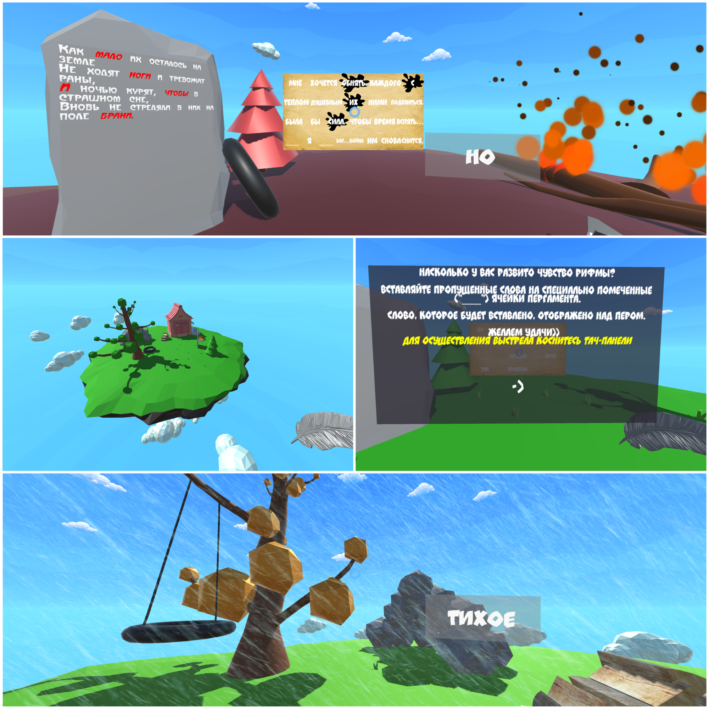

# VR-Refren

Игровое образовательное VR Приложение "Рефрен". Задача пользователя в соответствии с рифмой заполнять пропуски слов в стихотворении. 
Стихотворение делится на четверостишья, внешнее окружение зависит от тематики произведения. Существует 5 локаций: война, весна, лето, осень, зима.
Игровой процесс имеет соответствующее окружению приятное музыкальное сопровождение, а в конце раунда стихотворение озвучивается приятным женским голосом.

Создано на Unity, C#

